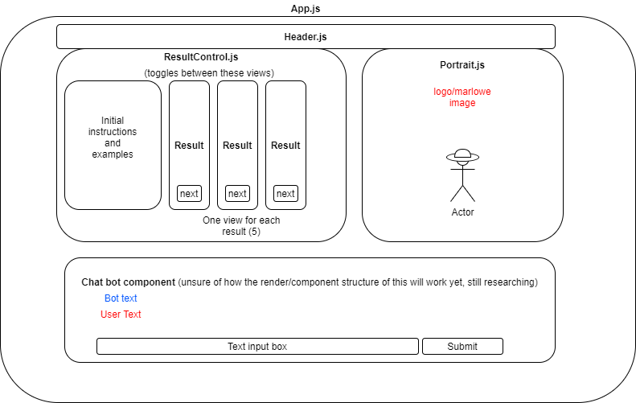

# Marlowe
## By: Rachel Schieferstein // May 2020

#### This project was bootstrapped with [Create React App](https://github.com/facebook/create-react-app).

## Description

An interactive detective-themed chatbot with a front end based in React with a node.js/Express backend that will handle querying and actions. It will ask the user questions and then use their answers to query API's/database to find movies that match their answers (genre, actors, plot, era). The chat bot aspect will be handled inside of DialogFlow, and database will either be MongoDB or Firebase (not sure yet). May potentially have a limited batch of movies in a database to query- not sure yet.

## Diagrams

## Setup/Installation Requirements

## Known Bugs

## Support and contact details

## Technologies Used

node.js
express
react 
dialogflow
heroku
git
api
mongodb at first, maybe firebase final?