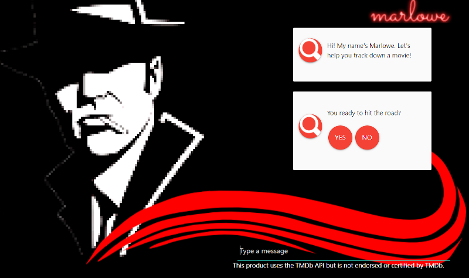

# Marlowe
## By: Rachel Schieferstein // May 2020

#### This project was bootstrapped with [Create React App](https://github.com/facebook/create-react-app).

## Description

An interactive detective-themed chatbot with a front end based in React with a node.js/Express backend that will handle querying and actions. It will ask the user questions and then use their answers to query the TMDB API. It searched by genre, year and "unpopularity"- finding relatively unknown films for the user by year.

The chat bot aspect is handled inside of DialogFlow, and can respond to certain questions and queries outside of the movie functionality.

## Diagrams

## Setup/Installation Requirements

Deployed at Heroku:

https://rocky-meadow-29560.herokuapp.com/

## Stretch Goals

* Create other events and dialogue trees
* Train on phrases and words to capture variation in sentence structure
* Add more genres to be searched
* Error responses in both APIs
* Migrate TMDB API call to Express/node.js backend
* Create logins/have users add movies they want to see to a database

## Known Bugs

N/A

## Support and contact details

_Have a bug or an issue with this application? [Open a new issue](https://github.com/violenzae/marlowe-movie-recommend/issues) here on GitHub._

## Technologies Used

* node.js
* Express
* React 
* DialogFlow
* TMDB (The Movie Database) api
* Materialize CSS
* Axios
* Github
* Heroku

An excellent Udemy tutorial on implementing the chatbot technology by Jana Bergant: 

https://www.udemy.com/course/chatbot-for-website-with-react-and-nodejs/