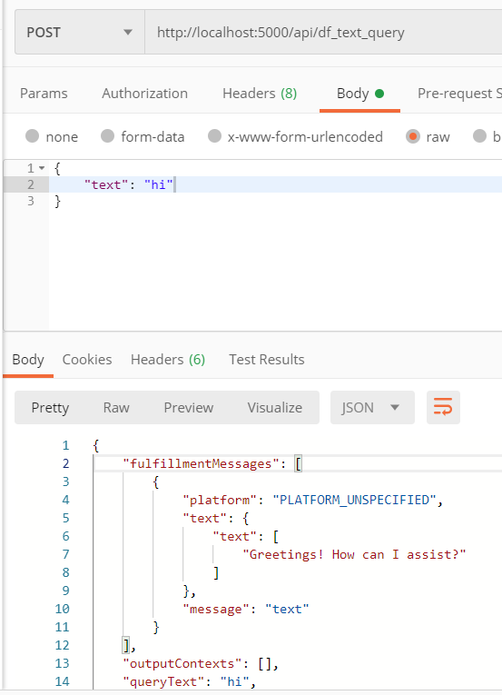

5/8/20

8:30am - purchased 10 hr udemy course on creating react chatbots and started following: https://www.udemy.com/course/chatbot-for-website-with-react-and-nodejs/

9:20am - created data flow diagram for top down look at the connected app parts

9:50am - created dialogflow account and base "agent"

10:39am - configuring custom default responses (ie "don't understand") and then user welcome triggers (ie "hello" "sup" "good morning) within the dialogflow console

11:06am - discovered dialogflow has the skeleton of a prebuilt video searcher with parameters/intents/entities for actors and directors and genres D: the actions aren't set to do anything yet obviously but super helpful!!

11:48am - adding a ton of common small talk/chit chat responses in dialogflow console

12:03pm taking a break on small talk and dialogflow, will do component diagram after lunch

1:50pm added kind of bad component diagram, still need to research how the chat bot text aspect can be rendered in react via tutorial

3:00pm working on backend portion of chatbot tutorial for awhile now, reconfiguring file structure to add in react later. hopefully does not break the repo

3:43pm created heroku deploy for backend (https://rocky-meadow-29560.herokuapp.com/)

4:19pm installed lots of dependencies, created basic route skeleton. set up separate google service account for api client of dialog flow

------
 
 5/15/20

 9-11AM: Reading about deployment methods, backend API calls and eating breakfast

 11am: updating api calls to await/async to declutter code

 11:20: OH HELL YEAH API SUCCESS

